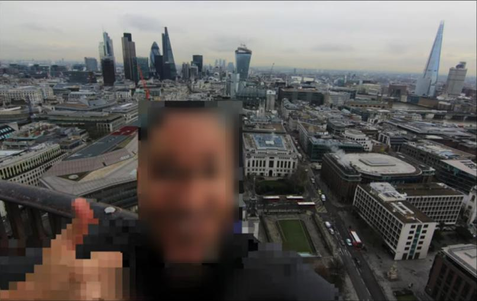
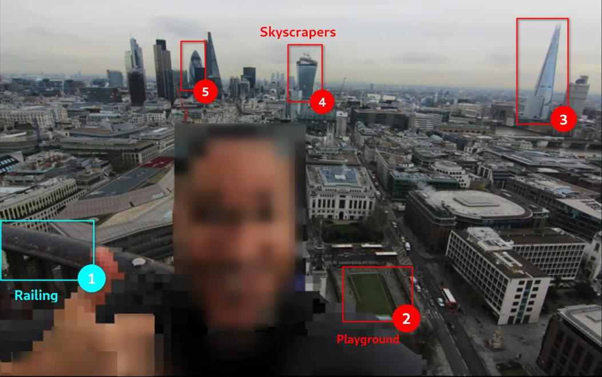

The awesome Urban Shot used in this article was created by [Artua](https://dribbble.com/Artua)

This article is going to be focused on geolocating images, specifically using Landmarks.

Geolocation means finding the real world location of an object, such as the place where a photograph was taken. This process is rather straightforward but there are various methods - some more creative than others - of doing so. You don't always get enough clues from an image's metadata (data about data) and most images won't typically show a famous landmark in the background to help you locate the area, town or even country.

According to GEOINT Analyst *Benjamin Strick*[^1], there are 5 key elements one should consider when looking at an image:
- Context
- Foreground
- Background
- Map markings
- Trial and error

# Methodology: Reduce Your Area of Interest

## Context
Usually we have a context in which the image was produced or shared, called context clues. For example, things like type of architecture, important landmarks and any other clues where this location could be in relation to land. Any piece of information, no matter how minor it may appear, could give an image more context. As an example, while searching for a missing person, an image of a banana leaf led investigators to research where banana production exists in the world.

One of the more obvious ways we can geolocate an image is to look at the image details:
- Who posted the image?
- Where was it posted?
- Does it contain metadata?
- Is there a location tagged on social media?

Your investigation also serves as context.

## Image Analysis
Be creative and scan the image for visual clues. Look for Point-Of-Interests in the image like its landscape, terrain, road layouts, a river, bridge, statue or a steep hill or for unique features like vegetation, specific trees, windows, street art, business names, architectural details like light-posts, balconies or rooftops in the Background as well as Foreground.

### Reverse image search
One of the methods for geolocating an image is to do an image reverse search. This means that if the image has been indexed by search engines we may find the exact image or we can do a visual or crop search to help us find similar images. Remember that changing the crop and the keywords for searching an image may yield completely different results.

I like to use this browser addon to ease the workflow when I find images online that I want to do an image reverse on:

<abbr title="Perform a search by image">RevEye Reverse Image Search</abbr>

For [Chrome](https://chrome.google.com/webstore/search/RevEye%20Reverse%20Image%20Search?hl=no),
For [Firefox](https://addons.mozilla.org/nb-NO/firefox/addon/reveye-ris/)

### Let's see an Example
Consider we are provided below image for analysis:

From the things we discussed above, we can see some odd buildings which really stand out and something like a playground in the background (marked in red). If we pay close attention, we notice something in the foreground (marked in cyan) also which, probably, is a railing. We can later use it for confirmation purposes like actually from where the
photo was taken.

Keeping these point of interests in sight, a reverse image search tells us that the image was taken in London and the skyscrapers and railing help confirm it.

## Map Markings
Orienting an image on a map provides valuable insights. If compared to Traditional mapping platforms, Local mapping platforms or data sets sometimes provide more valuable information. Sources like **Weather Underground** can be used to check historical weather data to corroborate image dates with weather at various locations, *WolframAlpha* to establish a time frame based on rainfall or *London Street Trees* to locate a particular type of tree across the city. *SunCalc* is another useful resource to identify a particular location using the sun's direction and shadow in an image.

A tool like *Wikimapia* allows users to annotate maps, include adding the names and locations of various structures. We can later add place marks on *Google Earth* or *Google Maps* as they have variety of different other options.
- Keep an Eye for what is NOT in your image/video?

During a Bellingcat investigation to geolocate an image of mass executions in or near Benghazi, a Twitter user noticed the color of the sand was grey compared to other areas of Benghazi, where colors of the sand are more orange or yellow. This tip helped investigators identify the location to be in the southwest area of Benghazi. Furthermore, this was the first instance when (in August 2017) the International Criminal Court (ICC) issued its first ever arrest warrant solely based on evidence gathered via social media.

## Trial and Error
Sometimes you need to revisit previous assumptions. When you feel like giving up, go back repeatedly and revisit your assumptions, check if any possible suspicion or guess may be correct or not. Try to look for what is not in an image. Even when an image shows no clear horizon, the lack of a horizon could become just as useful to reduce your area of interest.

## Further Tips
While geolocatting, it's important to know what is and isn't likely to be in a country. For example, it is unlikely for a regular Catholic church to appear in places where Budhism / Islam is the most popular religion. The language used on the shops and vehicles matter too. We can use Google translate to predict what language it could be. Which side of the road the cars are on, the license plates, the markings on the road (different countries have different markings), the style of traffic lights, the clothing choices of those walking around.

To be good at geolocation, we've got to open our eyes to all that could be. In your country, for example, it may be common to wear coats during the winter periods. However, in other countries it may not be (think). Even the smallest of things that we wouldn't normally think twice about can reveal to us the possible location.

- Still wandering? Here's a nice (beginner) geolocation challenge write-up https://www.secjuice.com/geolocation-osint-amateur-hour/

### For Improving Skills
- Follow *@quiztime* on Twitter
- Play a lot of *Geoguesser*!

## References
- Benjamin Strick (on Twitter): https://twitter.com/BenDoBrown
- Weather Underground: https://www.wunderground.com/history
- WolframAlpha: https://www.wolframalpha.com/examples/science-and-technology/weather-and-meteorology/
- London Street Trees: https://apps.london.gov.uk/street-trees/
- SunCalc: https://www.suncalc.org/
- Wikimapia: https://wikimapia.org/
- Geoguesser: https://geoguessr.com/
- Identify a location from a photo or video: https://youtu.be/RoqWbpZUOSo
- Robin Taylor's session "More Than Meets the Eye: Geolocation for human rights investigations" at the Investigation is Collaboration conference: https://cdn.ttc.io/s/exposingtheinvisible.org/iic-conf/slides/Geolocation_RTaylor.pdf
- OSINT Geo Location: https://rallypoint.withyouwithme.com/cyber_challenges/osint-geo-location/
- Geolocation Techniques - Mapping Landmarks: https://www.bellingcat.com/resources/how-tos/2014/07/15/geolocation-techniques-mapping-landmarks/
- Google Earth: https://earth.google.com/
- Google Maps: https://www.google.com/maps
- Bellingcat: https://www.bellingcat.com/

*\* This article was originally published in [this](https://www.amazon.com/dp/B09PHHDFBM) Cyber Secrets Edition.*
