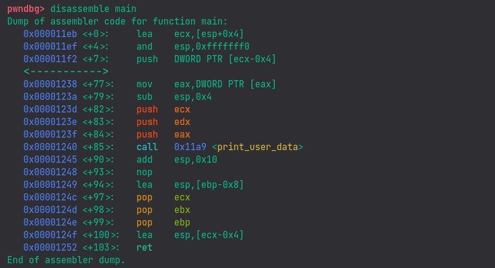

! We will not be diving deep into things but only as much as necessary. For further learning, I'll link relevant resources.

## 0.1 Prerequisites

- Basic Computer Science knowledge
- Fundamental knowledge of C - here is a nice [tutorial](https://www.tutorialspoint.com/cprogramming/index.htm)
- Curiosity - Consistency

### Optional

- Since, at first, we will be doing exploit development on Linux, it would be nice to learn the necessary things [here](https://tryhackme.com/module/linux-fundamentals).
- Some Assembly knowledge will benefit you a lot - here is a nice [tutorial](https://www.tutorialspoint.com/assembly_programming/index.htm)
- <abbr title="GNU Debugger">Gdb</abbr> is going to play a key role in our exploit dev - here's a lovely [tutorial](https://www.cs.umd.edu/~srhuang/teaching/cmsc212/gdb-tutorial-handout.pdf)


## 0.2 Memory Structure

### High-level overview


- More [here](https://exploit.courses/files/bfh2022/day1/0x11_MemoryLayout.pdf)

## 0.3 Architectures Comparison

Here's a C program:
```c {linenos=false}
#include <stdio.h>

void print_user_data(char* arg1, char* arg2, char* arg3){
    printf("Here is Your data\n");
    printf("Name: %s  Age: %s  Job: %s\n", arg1, arg2, arg3);
}

void main(int argc, char **argv){
    if (argc!=4){
        printf("Please provide 3 inputs\n");
    }
    else {
        print_user_data(argv[1], argv[2], argv[3]);
    }
}
```
The program takes some command line arguments from the user, checks if they are equivalent to 3 and then passes them to another function which prints some data on the console.

<details>
<summary>After compiling the code</summary>

with <abbr title="GNU C Compiler">gcc</abbr> as:
```shell
gcc code.c -o code
```
or
```shell
make code
```
make command is just another shortcut for us (for gcc)
</details>

Here' what it does:


Simple enough, right? 

When we execute a binary, the binary name and the arguments to its function(s) are stored on the stack (in memory). They are accessed differently in different architectures.

After seeing the disassembled binaries of both <abbr title="Architectures">archs</abbr>, you will notice that the length of memory addresses changes. But.. wait
> How are the command line arguments being parsed in memory?

Let's compile the code, disassemble it, and see what's happening under the curtains.

### x32

Compile the code with the command: `gcc -m32 code.c -o code`
<details><summary>Why -m32?</summary>
When we're on a 64-bit <abbr title="Operating System">OS</abbr>, the -m32 flag tells the compiler (gcc) to compile the code and give us a 32-bit binary. If you are on 32-bit machine, you can skip it.
</details>
<br>

<details><summary><b>Disassembly</b></summary>
You can just follow along with the tutorial, but if you're curious how I disassembled the binary, here you go.

There are many a ways/tools to disassemble a binary. Here, I have used gdb in the following way:
```shell
gdb code            # 'code' is the name of our binary
b main              # instructing gdb to break at main function
disassemble main    # disassemble the main function
```

</details>



In the case of 32-bit binary, we can see that first, the arguments are being _pushed_ onto the stack and then the call to our function `print_user_data` is made. They are later _popped_ off the stack before the program exits.

### x64

Compile the code with the command: `gcc code.c -o code`

**Disassembly**


On the other hand, in the case of 64-bit binary, arguments are first _moved_ into registers and then our function `print_user_data` is called.

Now that you understand the distinction between the two, it will come in handy later on, as we will be putting 32-bit binaries to test more frequently for simplicity.

## 0.4 ELF

The last thing to be aware of are the ELF files. Wondering what they are?

ELF files, short for Executable and Linkable Format, are standard executables for Linux and other Unix OSs (consider them the EXE files of Windows).

And as for our current program, as we compiled it on Linux, it also is an ELF file.


We might discuss them in detail later on. For further study, here's a nice [video](https://youtu.be/ddLB8A1ai_M "Deep Dive Into ELF Binaries - PinkDraconian").
