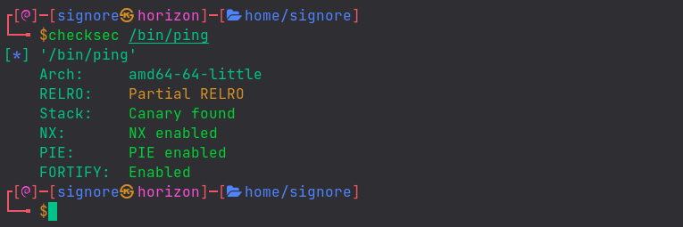

In this post, we will see what is a buffer overflow and will exploit it to get code execution.
Do Not feel overwhelmed. Just follow along and we'll have fun.

If you are new to the series, check out my previous posts [here](/blog/series/binary-exploitation-adventures)

## The Stack

Take this C program:


```c
#include <stdio.h>
#include <unistd.h>

int helper(){
    system("/bin/sh");      // executes system shell
}

int overflow(){
    char buffer[500];       // declaring buffer variable with specified size
    int userinput;
    userinput = read(0, buffer, 700);   // reading user input into buffer variable
    printf("\nUser provided %d bytes. Buffer content is: %s\n", userinput, buffer);
    return 0; 
}

int main(int argc, char *argv[]){
    overflow();
    return 0;
}
```


If we break down the program from the `main` function, it calls the `overflow` function which declares a variable of size 500 bytes and then, reads user input into that variable. Later, it prints the size of the provided input along with the input itself.

After compiling, here's what the program does:




You have to compile the program with the following command:

```shell
gcc -m32 -fno-stack-protector -z execstack program.c -o program
```


Also, you need to disable ASLR with the following command:

```bash
echo 0 | sudo tee /proc/sys/kernel/randomize_va_space
```


<details><summary><b>What's happening here?</b></summary>

> Modern programs come with a bunch of exploit mitigations.
> For example, we can see the protections on the `ping` binary which is mostly present on linux as well as windows, with `CheckSec` tool.
> 

> 
>
> So, initially we'll be working with those protections disabled and that is why we're giving those extra flags to gcc.
>
> For now, you don't need to care about them. We'll learn to bypass some anti-exploit mechanisms later on.
</details><br>

Let's see what's happening in memory.

### Theory

### Practical

## Stack Abuse

### Theory
What if we give the program unexpected input?

### Practical
Let's run our program with a different input.

## EIP Control

### Code Reuse

--

## Shellcode
