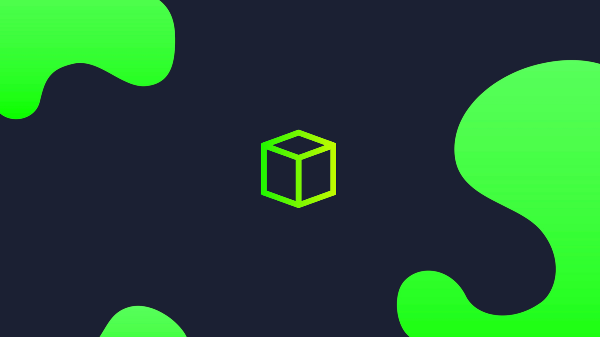

<!-- <h2> :penguin: </h2> -->
<ul>

<li>

<!-- Github   -->
[Sweet-HTB: Modern theme for Hackers](https://github.com/the-root-user/sweet-htb)  
Modern theme for Hackers, with dark colors - Inspired from the UI of Hackthebox

</li>

</ul>